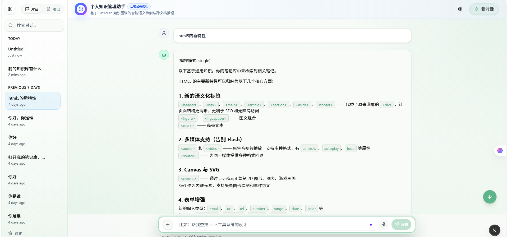
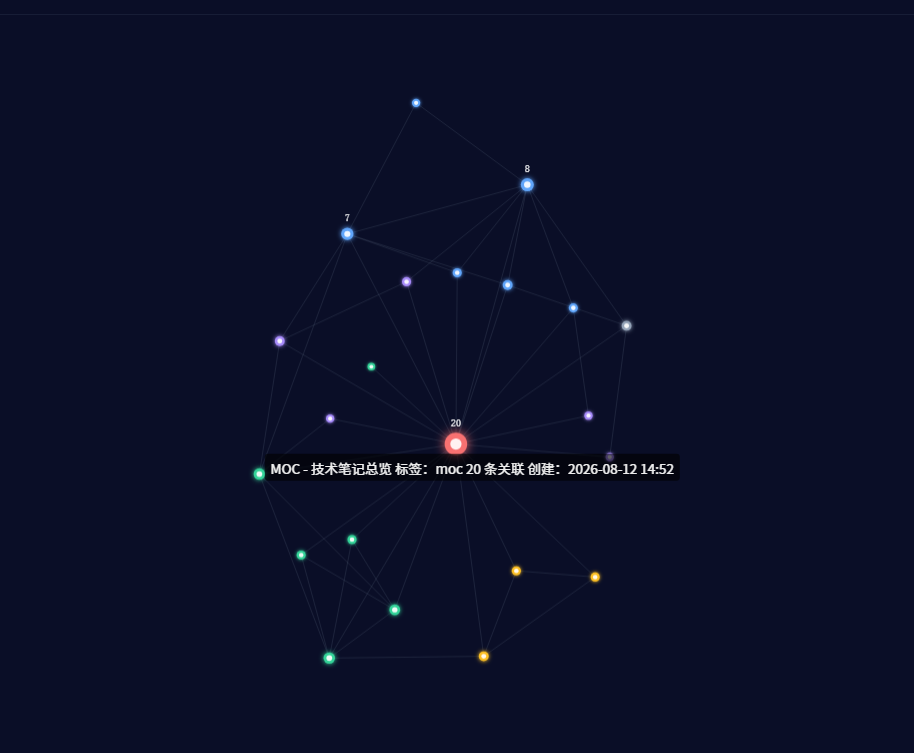
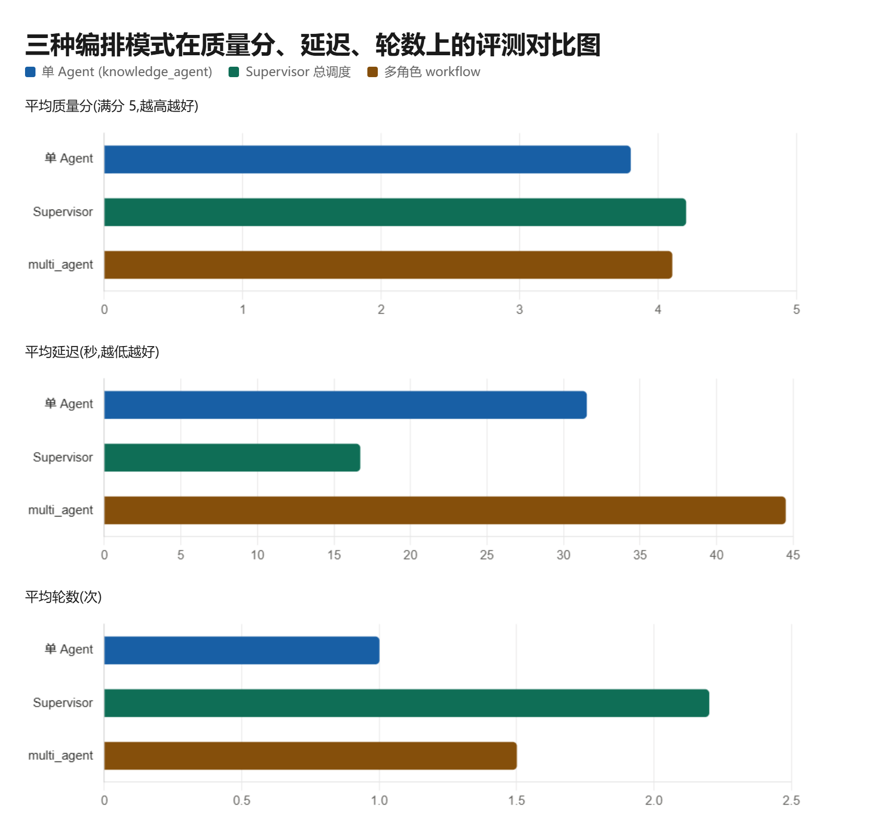

# Personal Knowledge Agent

> 基于 LangGraph + LlamaIndex 的私人知识管理 Agent —— 连接 Obsidian 笔记库，做混合检索、知识图谱推理与多 Agent 编排。


---

## 目录

- [简介](#简介)
- [截图](#截图)
- [技术栈](#技术栈)
- [架构总览](#架构总览)
- [检索管线](#检索管线)
- [多 Agent 编排](#多-agent-编排)
- [项目结构](#项目结构)
- [快速启动](#快速启动)
- [测试与评估](#测试与评估)
- [量化数据](#量化数据)
- [开发阶段](#开发阶段)
- [License](#license)

---

## 简介

我的 Obsidian 里躺着 22 篇技术笔记，覆盖 3 个项目的架构设计与踩坑记录。这个项目用 LangGraph 搭了一个 Agent：

- **不只是向量检索** —— 混合检索（向量 + BM25 → RRF 融合 → Cross-Encoder 重排）
- **利用 [[wikilink]] 图谱**做上下文扩展（BFS 图遍历）
- **能检索项目源码**（ellie / AI Code Review Agent）
- **三种 Agent 编排模式**并存：单 Agent、workflow 式多角色、Supervisor 总调度
- **MCP 协议暴露** 7 个检索工具，可供 Claude Desktop / Cursor 等外部 Agent 调用

## 截图

> **待补充**：将真实运行截图放入 `docs/screenshots/` 并替换下方图片路径。
> 建议截图清单（点击查看拍摄要点）：

| # | 截图 | 说明 |
|---|------|------|
| 1 | `docs/screenshots/chat.png` | 聊天问答界面（问题 + 带来源引用的回答） |
| 2 | `docs/screenshots/graph.png` | 知识图谱可视化（笔记 [[wikilink]] 关系网） |
| 3 | `docs/screenshots/notes.png` | 笔记浏览（列表 / 详情 / 标签） |
| 4 | `docs/screenshots/benchmark.png` | 三种编排模式评测对比（质量分 / 延迟 / 轮数） |
| 5 | `docs/screenshots/mcp.png` | MCP 工具接入外部 Agent（Claude Desktop / Cursor） |

```markdown
<!-- 替换为你的真实截图 -->




```

## 技术栈

| 层级 | 技术 |
|------|------|
| Agent 编排 | LangGraph 1.0+ (StateGraph, checkpointer, middleware) |
| RAG 管线 | LlamaIndex + Qdrant + scikit-learn + jieba |
| 检索策略 | 向量 (embedding) + BM25 (关键词) → RRF 融合 |
| 重排序 | BGE-Reranker-v2-m3 (cross-encoder, 可选) |
| 知识图谱 | [[wikilink]] BFS 图遍历 (in-memory adjacency list) |
| 源码检索 | BM25 over ellie / Code Review Agent 项目源码 |
| 中间件 | Guardrails + ModelRetry + ToolRetry + Summarization |
| 增量更新 | watchdog 文件监听 → 自动重索引 |
| MCP 协议 | 7 个工具暴露给 Claude Desktop / Cursor |
| 可观测性 | LangSmith |
| 评估 | LLM-as-judge (1-5) + RAGAS + 10 条 ground-truth 数据集 |
| 默认模型 | DeepSeek V4 (via SiliconFlow) |
| 前端 | Next.js 16 + React 19 + Tailwind CSS 4 |

## 架构总览

```
┌─────────────────────────────────────────────────────────┐
│  接入层: Next.js 前端 · MCP Server · FastAPI API         │
├─────────────────────────────────────────────────────────┤
│  编排层: 四种 LangGraph graph 并存                        │
│    router_agent      入口 Router (分层路由 3 种模式)      │
│    knowledge_agent    单 Agent (create_agent + 中间件链) │
│    multi_agent        workflow 式多角色 + 检索闭环       │
│    supervisor_agent   Supervisor 总调度 + 3 workers      │
├─────────────────────────────────────────────────────────┤
│  RAG 管线: ingestion → chunking → indexer → retriever    │
│            → reranker → wikilink 扩展 (watchdog 增量)    │
├─────────────────────────────────────────────────────────┤
│  数据源: Obsidian vault (22 笔记) · 项目源码 ×2 · Qdrant │
└─────────────────────────────────────────────────────────┘
```

## 检索管线

```
用户查询
    ↓ 查询分析 (LLM 决策)
Dense (向量相似度) ──⊕── Sparse (BM25 + jieba 分词)
    ↓ RRF (Reciprocal Rank Fusion)
候选 top-15
    ↓ BGE-Reranker-v2-m3 (cross-encoder 精排)
    ↓ [[wikilink]] BFS 1-hop 知识图谱扩展
最终 top-5 结果 + 源码检索 (可选)
```

## 多 Agent 编排

项目实现了三种编排模式 + 一个入口 Router，可在 LangGraph Studio 中切换对比：

### 0. 入口 Router（`router_agent`）— 分层混合编排

`src/agent/router_graph.py` 自动为每条查询选择最合适的编排模式：

```
用户查询
   ↓ classify（双通道分类器）
   │  规则通道: 统计词→workflow · 复杂词→supervisor · 事实词→single（零 LLM 成本）
   │  LLM 通道: 无关键词信号时判断一次,失败回退 single（永不阻塞）
   ├─ single     → knowledge_agent（简单事实问答,最快）
   ├─ workflow   → multi_agent（固定/统计任务,确定性 pipeline）
   └─ supervisor → supervisor_agent（复杂/模糊任务,动态拆解）
   ↓ 统一输出（标注 [编排模式: xxx]）
```

- **规则优先**:简单查询零额外 LLM 调用,保证"简单任务最快"
- **LLM 兜底**:无特征查询(如"A 和 B 有什么区别")由轻量模型分类,失败回退 single
- **async 节点**:knowledge_agent 必须 await(async Guardrails hook),两个多 Agent 图经 `asyncio.to_thread` 调用

### 1. 单 Agent（`knowledge_agent`）
`create_agent` + 5 层中间件（Guardrails / Summarization / ToolRetry / ModelRetry / Fallback）+ 7 工具。

### 2. Workflow 式多角色（`multi_agent`）

```
用户查询
   ↓ Planner      拆子查询 · 选择检索策略 (notes / codebase)
   ↓ Executor     并行调用 search_vault / search_codebase（ThreadPoolExecutor）
   ↓ Summarizer   融合多源结果 → 草稿（标注来源）
   ↓ Critic       充分性检查（规则通道 + LLM judge 双通道）
   ├─ 不满意 & 轮数<2 → Query Rewrite → 回到 Executor（闭环重检索）
   └─ 满意 / 达上限  → Answer（带来源引用）
```

### 3. Supervisor 总调度（`supervisor_agent`）

```
Supervisor（总调度 LLM）每轮输出 {next, sub_query}，看全局工作历史
   ├─ next: search → search_worker（search_vault 语义检索）
   ├─ next: code   → code_worker（search_codebase 源码检索）
   ├─ next: graph  → graph_worker（get_note_graph 图谱扩展）
   └─ next: answer → 融合全部历史 → 最终回答（带来源）
        ↑ worker 结果追加到全局 messages 后回到 Supervisor 再决策
        └── 循环，轮数上限 MAX_ITERS=6 防死循环
```

设计要点：
- **分层用模型**：Planner/Critic/Rewrite/Supervisor 走轻量模型（默认 qwen3-8b），Summarizer 走主模型（默认 DeepSeek V4），均可 env 覆盖
- **全链路降级**：无 API Key 或 LLM 失败时仍可运行，闭环靠轮数上限防死循环
- **两种多 Agent 模式对比**：workflow 式（固定流水线、延迟低）vs supervisor 式（动态路由、灵活）——同一代码库内并存，可量化对比

## 项目结构

```
personal-knowledge-agent/
├── langgraph.json           # LangGraph 部署配置 (4 个 graph)
├── pyproject.toml           # Python 依赖
├── mcp_config.example.json  # MCP 客户端配置
├── run.bat / run.ps1        # 后端启动脚本 (--port 3001, 防 Qdrant 锁冲突)
├── src/
│   ├── agent/               # Agent 入口 + 模型配置
│   │   ├── config.py        # 8 模型注册表 + 中间件配置
│   │   ├── knowledge_graph.py  # 单 Agent 入口 (7 tools)
│   │   ├── multi_agent_graph.py # workflow 式多角色编排
│   │   ├── supervisor_graph.py  # Supervisor 总调度
│   │   └── router_graph.py      # 入口 Router 分层路由
│   ├── rag/                 # RAG 管线 (7 个模块)
│   │   ├── ingestion.py     # Vault MD 解析 + frontmatter
│   │   ├── chunking.py      # 语义分块
│   │   ├── indexer.py       # Qdrant 向量索引
│   │   ├── retriever.py     # 向量+BM25 → RRF → Reranker
│   │   ├── reranker.py      # BGE-Reranker-v2-m3
│   │   ├── wikilink.py      # [[wikilink]] 解析 + BFS
│   │   └── watcher.py       # watchdog 增量索引
│   ├── tools/               # Agent 工具集 (7 tools)
│   │   ├── vault_tools.py   # search_vault, get_note, tags...
│   │   └── codebase_tools.py # search_codebase (源码检索)
│   ├── mcp/                 # MCP Server (7 tools)
│   ├── middleware/          # Guardrails + Retry 等
│   ├── prompts/             # 系统提示词
│   ├── api/                 # FastAPI 端点
│   └── utils/               # 缓存 + trace 元数据
├── tests/
│   ├── rag/
│   │   ├── eval_dataset.py   # 10 条 RAGAS 评估数据
│   │   ├── benchmark_graphs.py # 三种编排模式评测
│   │   ├── report_benchmark.py # 评测报告生成
│   │   └── ablation.py        # 检索策略消融
│   └── unit/                 # 86 个单元测试
├── docs/                     # 面试题问集 / 简历写法 / 评测报告
├── frontend/                 # Next.js 前端
└── obsidian-vault/           # (外部路径, 默认 E:/agent-projects/obsidian-vault, 22 篇笔记)
```

## 快速启动

```bash
# 1. 创建虚拟环境
cd personal-knowledge-agent
python -m venv --system-site-packages .venv

# 2. 安装依赖
.venv/Scripts/python.exe -m pip install -i https://mirrors.aliyun.com/pypi/simple/ \
  langgraph-cli langchain-openai langchain-anthropic langchain-google-genai \
  langchain-deepseek langchain-baseten langchain-mcp-adapters qdrant-client \
  llama-index llama-index-vector-stores-qdrant llama-index-embeddings-openai \
  "langgraph-cli[inmem]"

# 3. 配置环境变量
cp .env.example .env
# 填入: OBSIDIAN_VAULT_PATH, OPENAI_API_KEY, OPENAI_BASE_URL, EMBEDDING_MODEL

# 4. 启动后端 (自动初始化 vault 索引 + 文件监听)
#    注意: 后端固定端口 3001 (防 Qdrant 锁冲突); 推荐直接运行 run.bat (自动检测/清理 3001 占用)
run.bat            # 或 .venv/Scripts/python.exe -m langgraph_cli dev --port 3001

# 5. 启动前端 (dev:local 已内置 NEXT_PUBLIC_LANGGRAPH_API_URL=http://127.0.0.1:3001)
cd frontend && npm install && npm run dev:local

# 6. 运行测试
.venv/Scripts/python.exe -m pytest tests/ -v

# 7. MCP 独立启动 (给 Claude Desktop / Cursor 用)
.venv/Scripts/python.exe -m src.mcp.server
```

## 测试与评估

- **86 个单元测试**：RAG 管线（wikilink / chunking / frontmatter / RRF / BM25）+ 三种编排图（路由 / 降级 / 闭环上限 / 端到端）+ FastAPI + prompts，全部免凭据可跑
- **10 条 ground-truth 评测集**：LLM-as-judge 打分 + RAGAS 指标
- **检索消融**：`python tests/rag/ablation.py`（纯向量 vs 纯 BM25 vs 混合 RRF vs 完整管线）
- **编排对比**：`python tests/rag/benchmark_graphs.py`（三种编排模式的质量 / 延迟 / 轮数），结果由 `report_benchmark.py` 生成 `docs/agent_benchmark.md`

### 评测结果（SiliconFlow 实测）

| 维度 | 结果 |
|------|------|
| 编排质量（LLM-judge 1-5，10 题） | 单 Agent **3.8** · 多角色 workflow **4.1** · Supervisor **4.2**（30/30 全跑通，0 失败） |
| 编排延迟（平均，已优化） | 单 Agent **31.5s** · 多角色 **44.5s** · **Supervisor 16.7s**（优化前 94.6/71.0/32.3s，总延迟 **-53%**） |
| 单 Agent 轮数 | 11.1 轮 → **1.0 轮**（快模型 + 命中即答 + 轮数上限） |
| 重复问题 | 语义缓存命中 **0.1s**（冷调用 44.4s → 热调用 0.1s） |
| RAGAS 指标（10 题） | faithfulness 0.44 · answer_relevancy 0.62 · context_precision 0.73 · context_recall 0.50 |
| 检索命中率（Recall@5） | **90%**（混合 RRF + reranker，消融实验见 `docs/evaluation.md`） |

> 性能优化（2026-08）：Agent 工具循环切 Qwen3-8B 快模型（`AGENT_MODEL_KEY` 可切回）、单 Agent 轮数上限 + 命中即答（`AGENT_MAX_ROUNDS`）、Router 入口语义缓存（`SEM_CACHE_*`，相似问题秒回）、前端流式输出子图 token。质量-延迟权衡如实记录于 `docs/agent_benchmark.md`。
>
> 编排评测：`python tests/rag/benchmark_v2.py`（断点续跑 + 即跑即存，跑完自动生成报告）；RAGAS：`python tests/rag/test_ragas.py --ragas`

## 量化数据

| 指标 | 数据 |
|------|------|
| LangGraph Graph | 4 个 (单 Agent + workflow 多角色 + Supervisor 总调度 + 入口 Router) |
| RAG 管线模块 | 7 个 (ingestion, chunking, indexer, retriever, reranker, wikilink, watcher) |
| Agent 工具 | 7 个 (vault×5 + codebase×2) |
| MCP 工具 | 7 个 (全量暴露) |
| 中间件 | 5 层 (Guardrails + Summarization + ToolRetry + ModelRetry + Fallback) |
| 模型支持 | 8 个 (DeepSeek, OpenAI, Anthropic, Google, Qwen, GLM, Gemini, Claude) |
| Vault 笔记 | 22 篇 (ellie×6, CodeReview×6, 技术专题×6, 秋招×3, MOC×1) |
| 源码项目 | 2 个 (ellie, AI Code Review Agent) |
| 评估数据集 | 10 条带 ground truth 的 Q&A |
| 单元测试 | 86 个测试函数 (全部免凭据) |

## 开发阶段

- [x] Phase 1：骨架搭建
- [x] Phase 2：混合检索 + 重排序 + 增量索引
- [x] Phase 3：代码感知 + MCP
- [x] Phase 4：评估 + 测试 + 面试材料
- [x] Phase 5：多 Agent 编排（workflow 式 + Supervisor 总调度）+ 编排评测

## Docker 部署（后端 + Qdrant + 前端）

容器化三服务编排，是面试中演示"生产化部署"能力的加分项：

| 服务 | 镜像 | 端口 | 说明 |
|------|------|------|------|
| backend | 本仓库 `Dockerfile`（python:3.13-slim + langgraph dev） | 3001 | LangGraph 服务，连 Qdrant **server 模式** |
| qdrant | `qdrant/qdrant:latest` | 6333 | 向量库，数据持久化到命名卷 `qdrant_storage` |
| frontend | `frontend/Dockerfile`（Next.js 16） | 3000 | 浏览器访问入口 |

Qdrant 连接模式由环境变量切换（已在 `src/rag/indexer.py` 实现，向后兼容）：
- 设置 `QDRANT_URL`（如 `http://qdrant:6333`）→ **server 模式**（Docker 默认，多进程共享，无文件锁）
- 不设置 → **local 模式**（单进程文件锁，本地开发默认）

```bash
# 1. 密钥：compose 自动读取仓库根目录 .env 的 OPENAI_API_KEY / OPENAI_BASE_URL
#    如需指向自己的 vault，设置 VAULT_HOST_PATH（默认 ../obsidian-vault）：
#    export VAULT_HOST_PATH="E:/你的路径/面试八股文"

# 2. 构建并启动
docker compose up --build

# 3. 访问
#    前端: http://localhost:3000
#    后端 API / LangGraph Studio: http://localhost:3001
```

> 索引在**首次查询时由 backend 懒加载构建**（写入 Qdrant 卷），无需额外初始化步骤。
> `NEXT_PUBLIC_LANGGRAPH_API_URL` 在**前端构建期**内联进浏览器包，因此指向宿主可访问的
> `http://localhost:3001`（而非容器内部 `backend:3001`）。

## CI/CD（GitHub Actions）

每次 `push` / `pull_request` 自动运行（见 `.github/workflows/ci.yml`）：

- **test**：跑 86 个**免 API Key** 的单元测试（LLM 调用全部 mock），并输出覆盖率
- **docker**：构建 backend + frontend 两个镜像，防止 Dockerfile 回归

测试无需密钥即可全绿——推到 GitHub 后 CI 徽章即生效（仓库地址 `LYL-TUST/MyKAG`）。

## 线上部署

见 [docs/deploy.md](./docs/deploy.md)：提供「云服务器自托管（Nginx + HTTPS）」
与「Serverless / PaaS（Render / Fly.io / Railway / 国内云）」两条路径，
以及面试话术。

## License

MIT License — 上传前请确保仓库包含 `LICENSE` 文件。

---

**面试相关材料**：[面试题问集](./docs/interview_qa.md) · [简历项目写法](./docs/resume_project.md) · [编排评测报告](./docs/agent_benchmark.md)（由 `python tests/rag/benchmark_graphs.py && python tests/rag/report_benchmark.py` 生成） · [部署手册](./docs/deploy.md)
